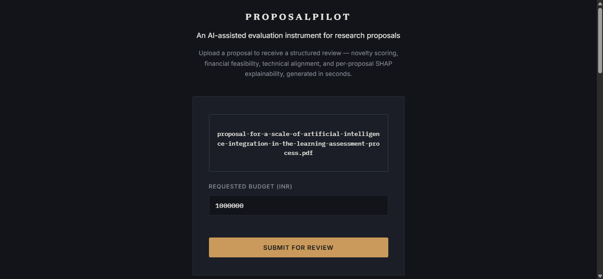
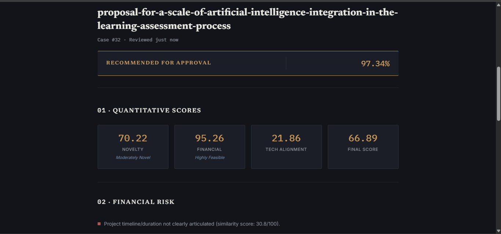
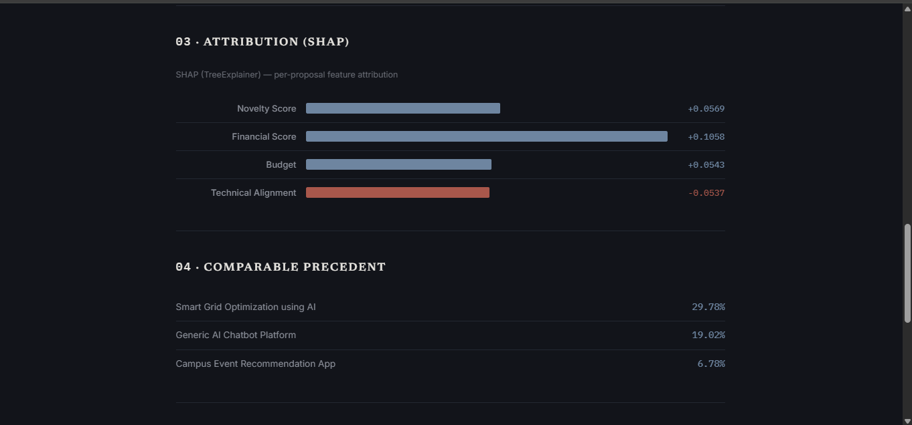
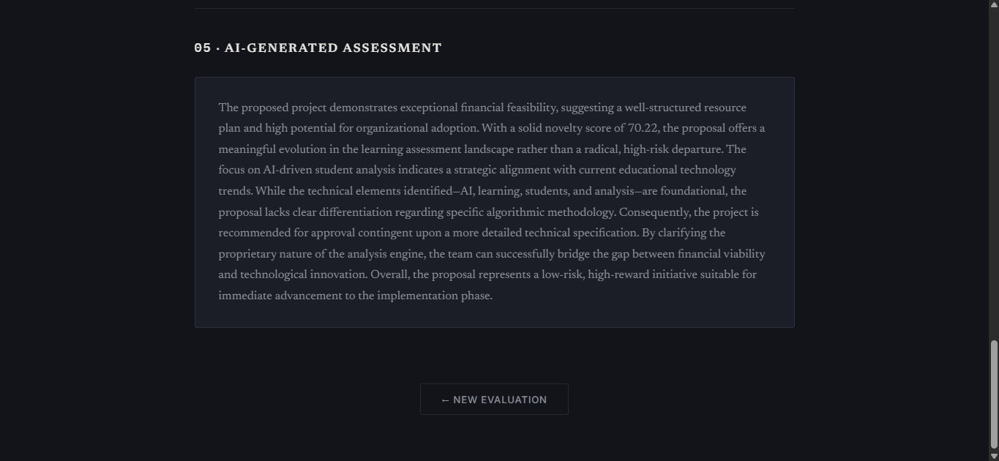

# ProposalPilot 🚀

### AI-Powered Proposal Evaluation & Decision Support System

ProposalPilot is an AI-assisted proposal evaluation platform that automates the assessment of research and R&D funding proposals. By combining Natural Language Processing (NLP), Machine Learning (ML), Explainable AI (XAI), and Large Language Models (LLMs), the system analyzes uploaded proposal documents and generates a structured evaluation report with transparent reasoning and actionable insights.

Rather than replacing human reviewers, **ProposalPilot** serves as an intelligent decision-support tool that streamlines the review process, improves consistency, and reduces the time required to evaluate large volumes of proposals.

---

## 📚 Table of Contents

- [📌 Problem Statement](#-problem-statement)
- [✨ Solution & Features](#-solution--features)
- [📐 System Architecture](#-system-architecture)
- [🛠️ Tech Stack](#️-tech-stack)
- [📸 Screenshots](#-screenshots)
- [📂 Project Structure](#-project-structure)
- [🚀 Setup & Running Locally](#-setup--running-locally)
- [🔮 Future Improvements](#-future-improvements)
- [✍️ Author](#️-author)

---

## 📌 Problem Statement

Research organizations, universities, and funding agencies often receive hundreds or even thousands of proposals for grants and innovation programs. Evaluating these submissions manually is a complex and resource-intensive process that requires reviewers to assess multiple aspects, including originality, technical feasibility, financial justification, and overall quality.

### Key Challenges

- **⏳ Time-Consuming:** Reviewing lengthy proposal documents manually slows down the funding process.
- **⚖️ Subjective Decisions:** Different reviewers may evaluate the same proposal differently, leading to inconsistencies.
- **🔍 Limited Transparency:** It is difficult to systematically explain why a proposal was accepted or rejected.
- **📚 Context Blindness:** Comparing new submissions against historical proposals is tedious and time-intensive.
- **📊 Limited Decision Support:** Traditional workflows lack tools that combine quantitative evaluation with clear, human-readable explanations.

As submission volumes continue to grow, there is an increasing need for intelligent systems that assist reviewers by providing fast, consistent, and explainable evaluations while keeping humans in the decision-making loop.

---

## ✨ Solution & Features

ProposalPilot addresses these challenges through a multi-stage AI evaluation pipeline that combines semantic text analysis, machine learning, explainable AI, and generative AI.

After a proposal PDF and requested budget are submitted, the system automatically extracts the proposal content, evaluates it across multiple dimensions, predicts the likelihood of approval, and generates an executive summary explaining the evaluation results.

### Key Features

- 📄 **PDF Text Extraction**
  - Extracts textual content from uploaded proposal documents using **pdfplumber**.

- 🔍 **Novelty Analysis**
  - Measures proposal originality by comparing it against previously funded proposals using **TF-IDF Vectorization** and **Cosine Similarity**.

- ⚙️ **Technical Alignment Evaluation**
  - Assesses how closely the proposal aligns with examples of technically rigorous research documents.

- 💰 **Financial Feasibility Assessment**
  - Evaluates budget justification, project scalability, and timeline clarity through semantic similarity analysis with proportional scoring.

- 🤖 **Proposal Classification**
  - Uses a **Random Forest classifier** to predict whether a proposal is likely to be approved based on engineered evaluation metrics.

- 🧠 **Explainable AI (XAI)**
  - Generates proposal-specific **SHAP** explanations that identify exactly which features contributed positively or negatively to the final prediction.

- 📝 **AI-Generated Executive Summary**
  - Utilizes the **Google Gemini API** to produce a concise, human-readable evaluation summary, with a template-based fallback when the API is unavailable.

---

## 📐 System Architecture

```text
                    User
                      │
                      ▼
             Upload Proposal PDF
                      │
                      ▼
            PDF Text Extraction
               (pdfplumber)
                      │
                      ▼
       Feature Engineering Pipeline
      ┌─────────────┬──────────────┬──────────────┐
      │             │              │              │
      ▼             ▼              ▼              ▼
   Novelty      Technical      Financial      Budget
   Scoring      Alignment     Feasibility
      └─────────────┴──────────────┴──────────────┘
                      │
                      ▼
         Random Forest Classifier
          ┌───────────┴───────────┐
          ▼                       ▼
 SHAP Explainability      Approval Prediction
          └───────────┬───────────┘
                      │
                      ▼
        Gemini Executive Summary
                      │
                      ▼
      Structured Evaluation Report
```


---

## 🛠️ Tech Stack

| Category | Technologies |
|-----------|--------------|
| **Frontend** | HTML5, CSS3, Vanilla JavaScript |
| **Backend** | FastAPI, Uvicorn |
| **Database** | SQLite, SQLAlchemy |
| **Machine Learning** | Scikit-learn (Random Forest) |
| **Natural Language Processing** | TF-IDF, Cosine Similarity |
| **Explainable AI** | SHAP (TreeExplainer) |
| **PDF Processing** | pdfplumber |
| **Generative AI** | Google Gemini API |
| **Testing** | pytest |

---

## 📸 Screenshots

### 🏠 1. Home / Proposal Upload

Upload a research proposal (PDF) and specify the requested budget to initiate the evaluation process.



---

### 📊 2. Evaluation Results

Displays the overall approval decision along with quantitative evaluation metrics, including novelty, technical alignment, financial feasibility, and the final evaluation score.



---

### 🧠 3. SHAP Explainability

Visualizes feature contributions using SHAP values, highlighting how each evaluation metric influenced the model's approval prediction for the submitted proposal.



---

### 📝 4. AI-Generated Executive Summary

Provides a concise, human-readable summary of the proposal evaluation generated by the Gemini API, with a fallback template when the API is unavailable.



---

## 📂 Project Structure

```text
ProposalPilot/
│
├── backend/
│   ├── api/
│   ├── services/
│   ├── config.py
│   ├── database.py
│   ├── models.py
│   └── main.py
│
├── ml/
│   ├── train_model.py
│   ├── shap_explainer.py
│   ├── vector_store.py
│   └── artifacts/
│
├── frontend/
│   ├── index.html
│   ├── style.css
│   └── app.js
│
├── data/
│   ├── past_projects.csv
│   └── uploads/
│
├── screenshots/
│   ├── home.png
│   ├── results.png
│   ├── shap.png
│   └── summary.png
│
├── tests/
├── requirements.txt
├── proposals.db
├── .gitignore
├── .env
└── README.md
```
---

## 🚀 Setup & Running Locally

### 1. Clone the repository

```bash
git clone https://github.com/amlinapanigrahi/ProposalPilot
cd ProposalPilot
```

### 2. Create a virtual environment

```bash
python -m venv venv
```

**Windows**

```bash
venv\Scripts\activate
```

**Linux/macOS**

```bash
source venv/bin/activate
```

---

### 3. Install dependencies

```bash
pip install -r requirements.txt
```

---

### 4. Configure environment variables

Create a `.env` file in the project root and add your Gemini API key.

```env
GEMINI_API_KEY=your_api_key_here
```

> **Note:** If no API key is provided, ProposalPilot automatically generates a structured template-based summary instead of an LLM-generated narrative.

---

### 5. Train the Machine Learning Model

```bash
python -m ml.train_model
```

---

### 6. Start the Backend Server

```bash
uvicorn backend.main:app --reload
```

The backend will be available at:

```
http://localhost:8000
```

---

### 7. Launch the Frontend

Open the following file directly in your preferred web browser:

```
frontend/index.html
```

---

## 🔮 Future Improvements

- Support OCR processing for scanned PDF proposals.
- Train the classifier using larger, real-world anonymized proposal evaluation datasets.
- Expand the historical proposal corpus for more robust similarity analysis.
- Implement secure user authentication and personalized reviewer dashboards.
- Add proposal version tracking and collaborative review workflows.
- Deploy the application on a cloud platform with persistent database storage.
- Introduce interactive, hoverable SHAP visualizations directly within the web interface.
- Support multiple machine learning models with a comparative evaluation panel.

---

## ✍️ Author

**Amlina Panigrahi**

B.Tech in Artificial Intelligence

Built as a portfolio project to demonstrate an end-to-end AI system integrating semantic text analysis, machine learning, explainable AI, LLM-assisted report generation, and full-stack web development.